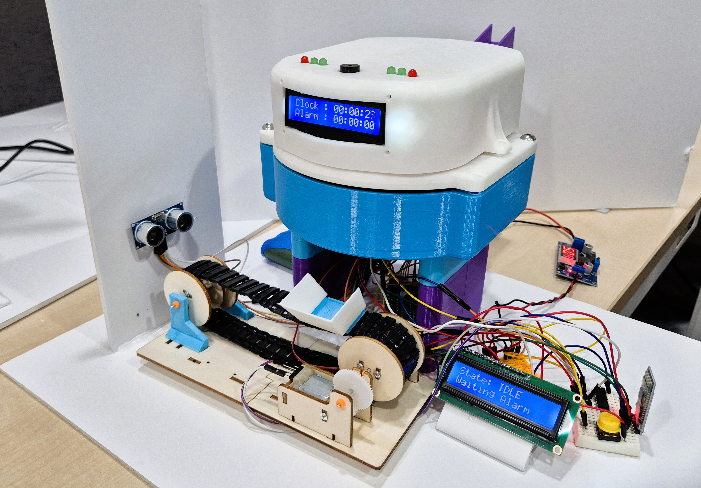
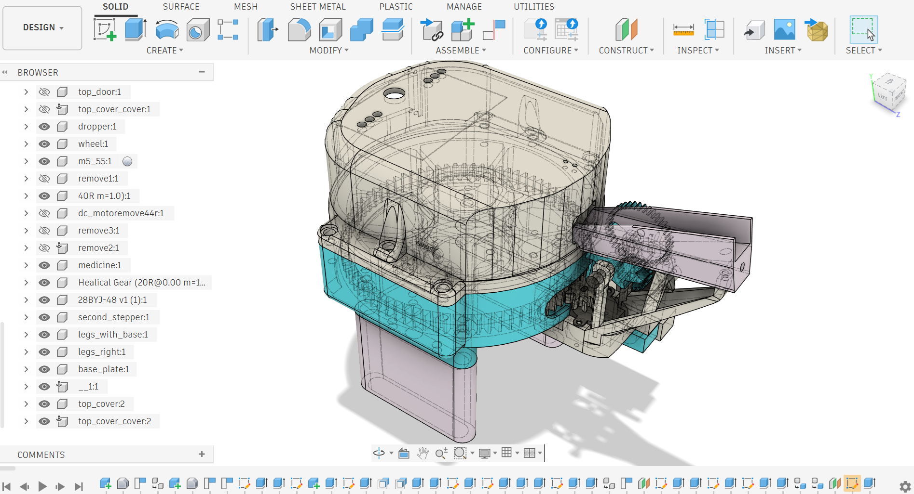
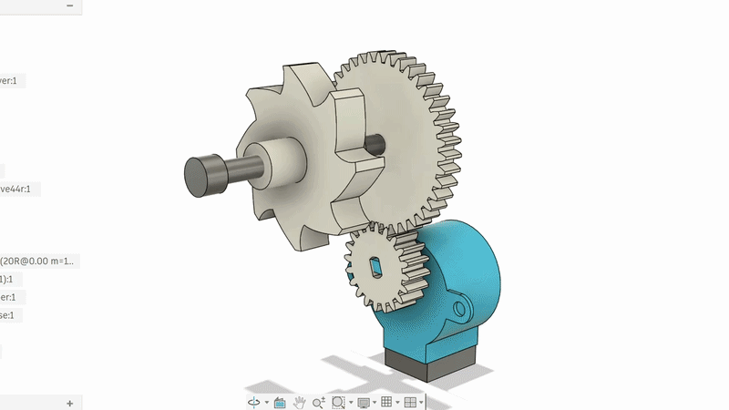
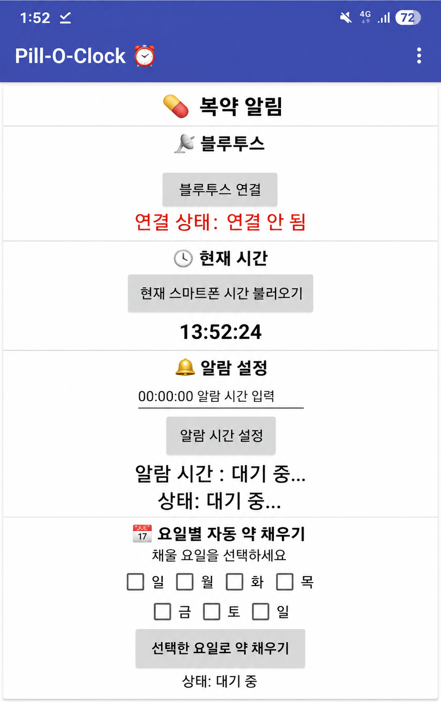
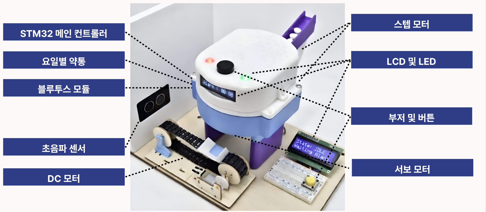
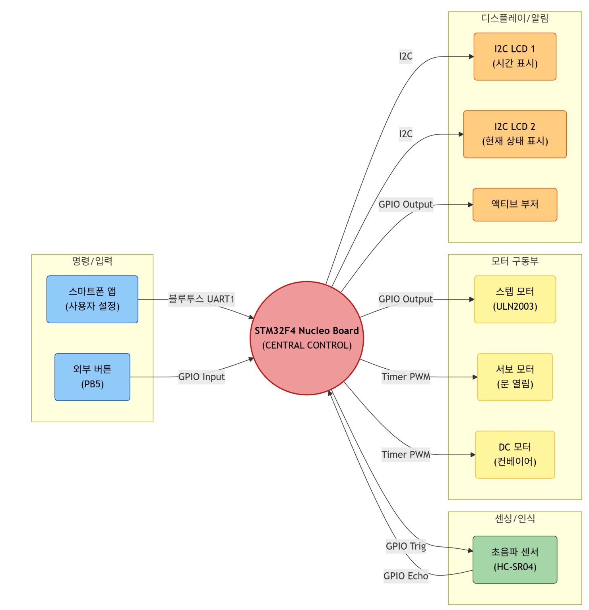
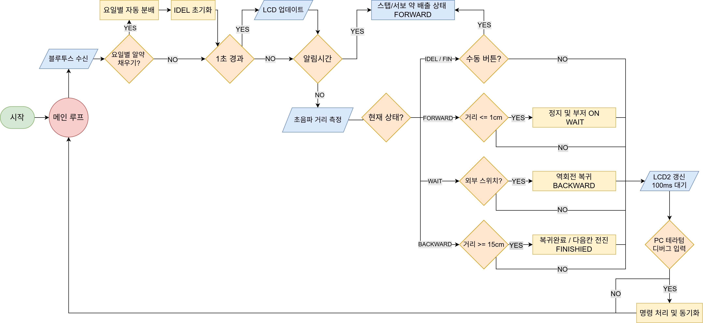
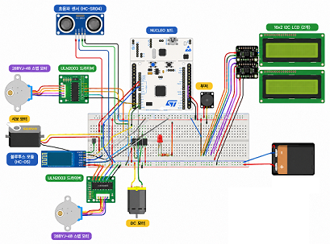
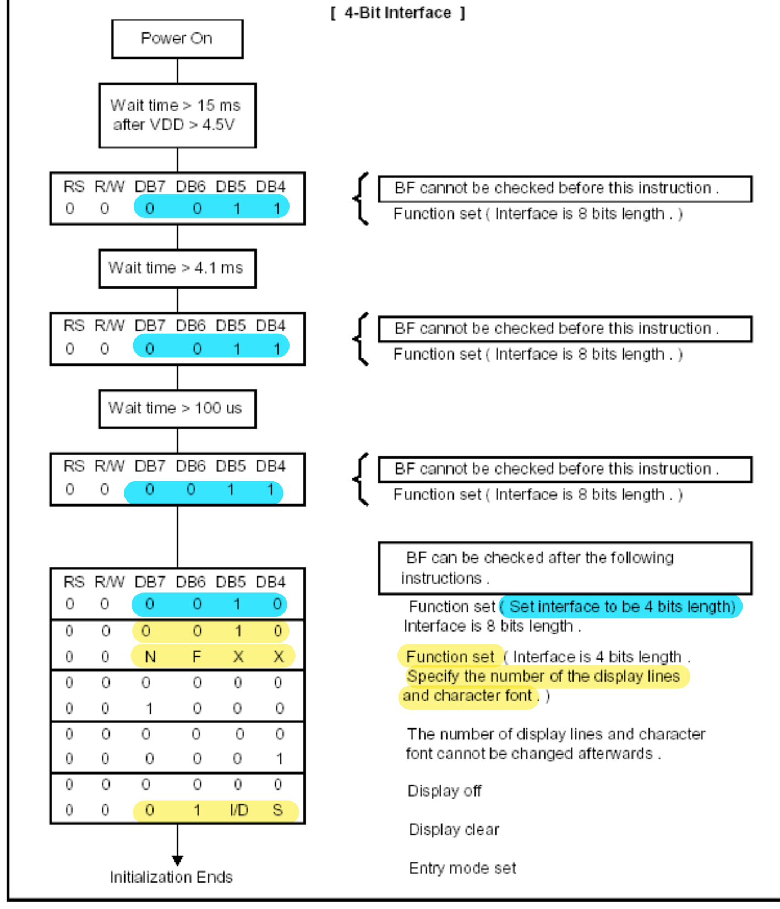
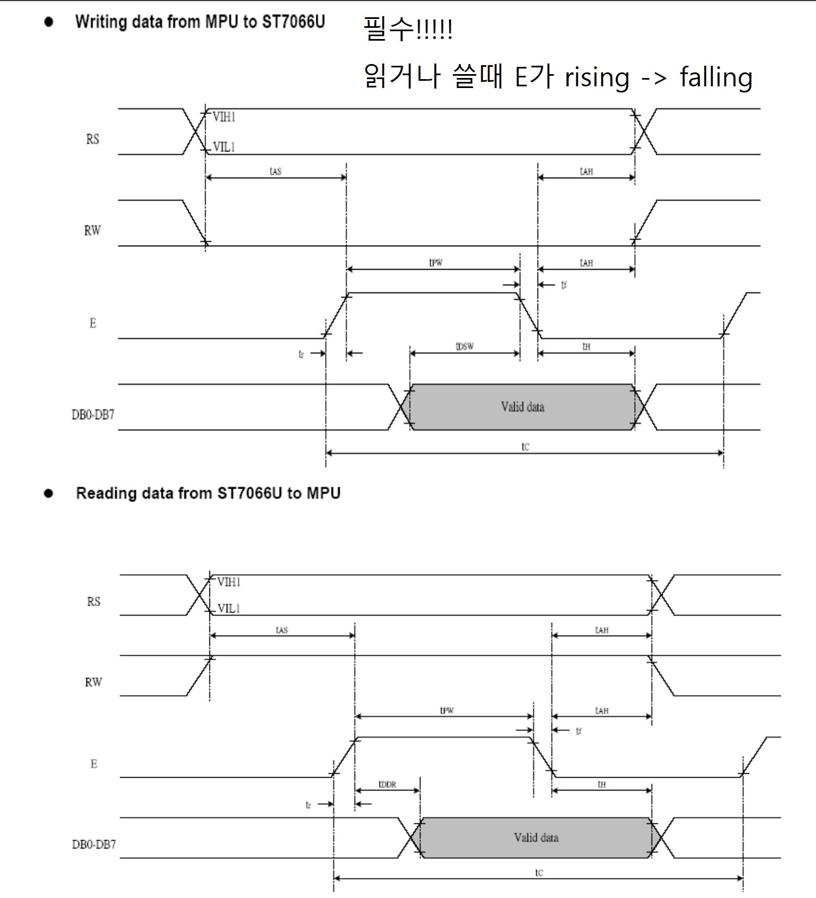

# 💊STM32 기반 스마트 알약 자동 디스펜서 (Pill-O-Clock)

본 프로젝트는 대한상공회의소 서울기술교육센터 AI 융합 로봇 SW 개발자 2기 과정 중 CORTEX-M4 기반 임베디드 시스템 제어 수업의 프로젝트로 진행되었다.

STM32F411 MCU가 탑재된 Nucleo-64 보드를 기반으로 하며, 레지스터 직접 제어로 스텝 모터, DC 모터, 서보 모터, LCD 스크린, 블루투스모듈, 초음파, led 제어를 하는 통합 시스템이다. 모든 하드웨어 자원을 통합적으로 응용하기 위해 '스마트 알약 자동 디스펜서'를 최종 주제로 선정하였다.


---

## 📌 프로젝트 개요

| 항목 | 내용 |
|------|------|
| **프로젝트명** | STM32 기반 스마트 알약 자동 디스펜서 |
| **개발 기간** | 2026.04.03 ~ 2026.04.13 (7일) |
| **개발 인원** | 4명 |
| **MCU** | STM32F411RE (ARM Cortex-M4, 100MHz) |
| **보드** | STM32 Nucleo-64 |
| **개발 방식** | HAL 라이브러리 미사용 · 모든 주변장치 레지스터 직접 접근 및 제어 |
| **주요 목표** | 복약 관리의 어려움을 겪는 사용자를 위한 자동화 솔루션 구현 |
| **결과** | 시간 및 요일별 자동 약 배출 시스템 완성 및 정상 작동 확인 |


---

### 배경 및 목적

복약 관리의 어려움을 겪는 고령자·만성질환자를 위해, 스마트폰 앱으로 손쉽게 복약 시간을 설정하고 자동으로 약을 배출해주는 IoT 기반 스마트 디스펜서를 개발하였다.

- **복약 관리 자동화** : 설정된 시간에 자동으로 약이 배출되어 복약 누락 방지
- **블루투스 앱 연동** : 편리한 복약 시간 설정 및 원격 제어 기능
- **요일별 약 관리** : 7개 약통으로 요일별 약 자동 배출 및 보충
- **사용자 알림 기능** : 부저 알림 및 복약 확인 기능으로 사용자 편의성 향상
- **친근한 디자인** : 인터랙티브 펫 컨셉의 외형 디자인 적용

---
## 📋 주요 기능

### 1. 자동 약 배출 시스템
- STM32 내부 타이머를 통한 정확한 시간 추적
- 설정된 복약 시간 도달 시 자동으로 배출 프로세스 시작
- 스텝 모터가 해당 요일 약통을 배출구로 정밀 이동 **(51.4°/일)**
- 서보 모터 PWM 제어로 배출구 개폐 **(0° ~ 45°)**

> **스텝 모터 계산식**  
> `32 steps × 기어비(64) × 약통 기어비(7.8) ÷ 7일 = 2,282 steps/일`

### 2. 알약 자동 보충 시스템
- 상부 알약 저장 공간에 모듈 형식으로 약통 장착 가능
- 스텝 모터가 정밀한 각도로 회전하여 한 칸씩 순차적으로 알약 적재
- 앱에서 요일 선택 시 해당 칸에 자동 보충

### 3. 블루투스 통신 및 앱 제어
- **HC-05 블루투스 모듈** 기반 STM32 ↔ 앱 양방향 UART 시리얼 통신
- 통신 속도: **9600bps** 안정적 데이터 전송
- 앱에서 전송된 복약 시간·요일 데이터를 STM32에 저장
- 설정 확인 및 시스템 상태 피드백 전송

| 앱 구성 모듈 | 기능 |
|---|---|
| 블루투스 연결부 | 장치 검색 및 HC-05 연결 |
| 시간/알람 설정부 | 현재 시간 표시 및 알람 비교 |
| 자동 채우기 전송부 | 요일 및 시간 데이터 문자열 송신 |
| 응답 수신부 | STM32 응답을 읽어 상태 표시 |

### 4. 센서 기반 이송 제어
- **초음파 센서**로 컨베이어 벨트 위 약의 위치를 실시간 측정
- 설정 거리 도달 시 DC 모터 자동 정지 → 약 분실 방지
- PWM 듀티 조정으로 모터 적정 속도 설정

### 5. 사용자 인터페이스
- **부저** : 복약 시간 알림 출력
- **버튼** : 복약 확인 입력 및 부저 정지
- **LCD** : 현재/다음 복약 시간 및 현재 동작 상태 실시간 표시
- **LED** : 시스템 동작 상태 표시


---

## 🛠 기술 스택

### Hardware
| 구분 | 부품 |
|------|------|
| MCU | STM32 (ARM Cortex-M) |
| 블루투스 | HC-05 모듈 (UART, 9600bps) |
| 액추에이터 | 스텝 모터 × 2, 서보 모터 × 1, DC 모터 × 1 |
| 센서 | 초음파 센서 (거리 측정) |
| 입력 | 푸시 버튼 |
| 출력 | LCD, LED, 부저 |
| 전원 | 외부 전원 모듈 (다중 모터 전류 대응) |
| 케이스 | 3D 프린트 (FDM, 인터랙티브 펫 디자인) |

### Software / Firmware
| 구분 | 내용 |
|------|------|
| Firmware |레지스터 직접 제어 (C언어, HAL 미사용) |
| 타이머 제어 | STM32 내부 RTC + TIM (PWM) |
| 인터럽트 우선순위 | NVIC 우선순위 설정: RTC 알람(1) > EXTI(2) > USART2(3) |

| 앱 개발 | MIT App Inventor (Android) |
| 3D 모델링 | Fusion 360 (3D 프린트용) |


---

##  📷  실물 사진




### 기구 설계
 
 

#### 스텝 모터 및 서보 모터 제어
 

- 스텝 모터: 요일별 약통 위치 제어(51.4°/일)
- 서보 모터: PWM으로 배출 타이밍 및 0°-45° 제어
- STM32 내부 타이머를 통한 정확한 시간 추적, 설정된 시간 도달 시 자동으로 배출 프로세스 시작

#### 스텝모터를 이용한 알약 공급 메커니즘

 

- 스텝 모터가 정밀한 각도로 회전 제어 및 한 칸씩 순차적으로 알약 적재

#### 앱
 

---

## 🎥 시연 영상

### [원본 동영상 (Youtube)](https://youtu.be/ekS_dpz__AQ)

 
 


---


## 📅 개발 일정

| 일차 | 내용 |
|------|------|
| 1일차 | 시스템 설계 (회로도, 기구 설계, 개발 계획 수립) |
| 2일차 | 앱 연동 (App Inventor ↔ HC-05 블루투스 통신 구현) |
| 3일차 | 제어 설계 (모터 제어 로직, RTC 알람, 인터럽트 처리) |
| 4일차 | 시스템 통합 (센서·모터·UI 통합, 전원 안정화) |
| 5일차 | 3D 프린트 완료 및 조립 |
| 6일차 | 최종 조립 및 기능 테스트 |
| 7일차 | 시스템 검증 및 PPT 제작 |


---

## 🏗 시스템 아키텍처




#### 하드웨어 플로우차트



#### 소프트웨어 플로우차트

 

```
[앱 인벤터 앱]
      │ 블루투스 (HC-05)
      ▼
[STM32 MCU]
  ├── 내부 RTC 타이머 → 알람 판단
  ├── 스텝 모터 A → 요일별 약통 위치 제어 (51.4°/일)
  ├── 스텝 모터 B → 상부 알약 자동 보충 메커니즘
  ├── 서보 모터   → 배출구 개폐 (0° - 45°)
  ├── DC 모터     → 컨베이어 벨트 구동 (약 이송)
  ├── 초음파 센서 → 약 위치 실시간 측정 → 벨트 정지 제어
  ├── 부저        → 복약 시간 알림
  ├── 버튼        → 복약 확인 입력
  └── LCD         → 현재/다음 복약 시간 및 동작 상태 표시
```

---

## 🔌 회로도

 

<br>

<br>

<details>
  <summary><b>핀맵</b></summary>

| 모듈 | STM32 핀 | 모듈 측 연결 | 전원 연결 | 비고 |
| :--- | :--- | :--- | :--- | :--- |
| 부저 | **PB6** | 부저 신호선 → PB6 | 별도 전원 없음 | TIM4_CH1 PWM 출력 |
| 외부 스위치 | **PB5** | 스위치 한쪽 → PB5, 다른쪽 → GND | 별도 전원 없음 | 내부 Pull-up 사용, 눌렀을 때 active-low |
| 블루투스 모듈 | **PA9**, **PA10** | 모듈 TXD → PA10, 모듈 RXD → PA9 | VCC, GND 연결 | USART1 사용 |
| PC 터미널 (UART2) | **PA2**, **PA3** | USB-UART TX ↔ PA3, RX ↔ PA2 | 보드 경유 | USART2 사용 |
| I2C LCD 1602 | **PB8**, **PB9** | SCL → PB8, SDA → PB9 | LCD VCC, GND | I2C1 |
| 초음파 센서 HC-SR04 | **PC4**, **PC5** | Trig → PC4, Echo → PC5 | 5V, GND | Echo 5V 레벨 주의 필요 |
| DC 모터 드라이버 입력 | **PA0**, **PA1** | IN1/PWM → PA0, IN2/PWM → PA1 | 드라이버 VM, GND 별도 | TIM5 PWM |
| 서보모터 (SG90) | **PA6** | Signal → PA6 | 5V, GND | TIM3 CH1 |
| 스텝모터 (28BYJ-48) 드라이버 1 | **PC0**, **PC1**, **PC2**, **PC3** | IN1~IN4 → PC0~PC3 | 드라이버 전원 별도 | 기존 약통 회전 |
| 스텝모터 (28BYJ-48) 드라이버 2 | **PC6**, **PC7**, **PC8**, **PC9** | IN1~IN4 → PC6~PC9 | 드라이버 전원 별도 | 약 보충/배출용 |
| 상태 LED 빨강 2개 | **PB12** | 각 LED 입력 | 적절한 저항 필요 | 약 배출 시 ON |
| 상태 LED 초록 4개 | **PA7** | 각 LED 입력 | 적절한 저항 필요 | 역회전 복귀 시 ON |
| 보드 LED | **PA5** | 추가 결선 없음 | 보드 내장 | 기본 LED |
| RTC (LSE) | **PC14**, **PC15** | 연결 금지 | LSE용 | RTC 때문에 점유 |~

</details>

<details>
  <summary><b>타이머 설정</b></summary>

| 타이머 | 비고 |
| :--- | :--- |
| TIM2 | 정밀 대기 (스텝/서보 간격)|
| TIM3 |	서보 모터 PWM (PA6) |
| TIM4 |	부저 PWM (PB6) |
| TIM5 |	DC 모터 PWM (PA0, PA1) |

</details>


---


## 📟I2C 1602 LCD 드라이버
STM32F4의 I2C1 주변장치를 레지스터 수준에서 직접 제어하여 PCF8574 기반 1602 LCD 드라이버를 구현하였다.

#### 하드웨어 구성
- 1602 LCD(주소 0x4E, 0x4C), PCF8574 I2C

#### 4비트 전송 방법
8비트 명령이나 데이터를 4비트로 나눠 두 번 보내고, 니블마다 EN 핀을 **High->Low**로 토글해서 LCD가 데이터를 래치하도록 했다.

PCF8574가 I2C로 받는 바이트 구조:
```
p7 p6 p5 p4 | p3  p2  p1  p0
d7 d6 d5 d4 | BL  EN  RW  RS
```

```c
// mode=0: 명령어(RS=0), mode=1: 글자(RS=1)
void LCD_Send(unsigned char addr, char data, int mode)
{
    // 상위 4비트 전송
    I2C1->DR = (data & 0xf0) | 0b1100 | mode;          // BL:1, EN:1, RW:0, RS=mode
    I2C1->DR = (data & 0xf0) | 0b1000 | mode;          // BL:1, EN:0, Falling Edge로 래치

    // 하위 4비트 전송
    I2C1->DR = ((data << 4) & 0xf0) | 0b1100 | mode;          // BL:1, EN:1, RW:0, RS=mode
    I2C1->DR = ((data << 4) & 0xf0) | 0b1000 | mode;          // BL:1, EN:0, Falling Edge로 래치
}
```

#### 초기화 시퀀스
HD44780 데이터시트의 4비트 초기화 시퀀스를 구현하였다. 전원 인가 직후 LCD는 8비트 모드로 동작하므로 상위 니블 0x3을 3회 전송해 인터페이스 상태를 동기화하고, 이후 상위 니블 0x2를 전송하여 4비트 모드로 전환하였다. 이후 Function Set(0x28), Display Control, Clear Display, Entry Mode Set 명령을 순차적으로 설정하여 LCD를 초기화하였다.


<details>
<summary><b>LCD 메뉴얼</b></summary>
  <div>
     
     
  </div>
</details>


---

## 🔥 문제 해결 과정 (Trouble Shooting)


### Case 1. 하드웨어 — DC 모터 토크 부족 & 전원 공급 불안정

#### 문제 상황

-저토크 DC 모터를 사용해 낮은 PWM 듀티에서는 기동 토크가 부족하여 컨베이어 벨트가 알약을 이송하지 못하고 정지했다.
모터 동시 구동 시 순간 피크 전류로 전압 강하 발생했으며 MCU 리셋이 되었다.

#### 원인 분석

듀티가 낮아 모터에 인가되는 평균 전압과 전류가 부족해 컨베이어 벨트를 구동할 충분한 토크가 발생하지 않았다.
단일 전원으로 다수 구동계에 전류 공급하면 피크 전류 초과로 전압 강하와 MCU 리셋 유발했다.

#### 해결 방법

PWM 듀티를 단계적으로 조정하여 컨베이어 벨트가 안정적으로 구동되는 값(50%)으로 설정했다.
모터 구동 전원을 외부 전원 모듈로 분리해 MCU 전원 라인과 격리했다.

#### 결과

컨베이어 벨트의 알약 이송이 안정화되었으며, 전압 강하로 인한 MCU 리셋 문제를 해결했다.

---

### Case 2. 스텝모터 초기 스텝 손실 보정

#### 문제 상황
약통을 하루치 칸만큼 회전(`Stepper2_One_Day`)시켰을 때, 실제 회전량이 목표 각도보다 미세하게 부족한 현상이 반복적으로 발생했다.
 
#### 원인 분석
정지 상태에서 목표 속도로 즉시 구동할 경우 기동 스텝 누락이 발생한다. 이는 첫 구동 신호에 동기화되는 과정에서 관성에 의한 반응 지연이 발생하고, 이로 인해 초기 제어 스텝이 실제 회전력으로 이어지지 못한 채 손실된다.
 
> 28BYJ-48 기준: 1회전 32스텝 × 내부 기어 64 = 2,048스텝/회전.
> 약통 기어비·7일 분할을 적용하면 **이론상 1일 회전 ≈ 2,282스텝**.
 
#### 해결
엔코더를 쓰지 않는 오픈루프 구조이므로, 누락되는 초기 스텝만큼을 보정값으로 더해 목표 각도를 맞췄다. 이론값 2,282스텝 대신 **2,290스텝**으로 설정.
 
```c
void Stepper2_One_Day(void)
{
    static int current_step = 0;
 
    for(int i = 0; i < 2290; i++)   // 초기 스텝 손실분 보정 (이론값 ≈ 2282)
    {
        Stepper_Step(current_step);
        current_step++;
        TIM2_Delay(5);              // 스텝당 5ms 간격
    }
 
    GPIOC->ODR &= ~(0xF << 0);      // 구동 종료 후 코일 전류 차단 (아래 2번 참고)
}
```
 
#### 개선 여지
근본 해결책은 기동 시 가속 램프를 적용하거나, 엔코더 기반 폐루프 제어로 실제 위치를 피드백받는 것이다. 이번 프로젝트에서는 비용과 복잡도를 고려해 오픈루프 보정 방식으로 처리했다.

<br>


###  Case 3. 스텝모터 대기 시 발열 제어
 
#### 증상
회전이 끝난 뒤에도 모터와 ULN2003 드라이버가 지속적으로 발열이 발생했으며, 동작이 없는 대기 상태에서도 계속 뜨거워졌다.
 
#### 원인
스텝모터는 위치를 유지하는 동안 코일에 전류가 계속 흐른다. 마지막 스텝 패턴이 GPIO 출력에 그대로 남아 있으면 ULN2003을 통해 코일에 전류가 계속 공급되어, 발열과 불필요한 전력 소모가 발생한다.
 
#### 해결
회전이 끝나면 해당 모터의 GPIO 출력 비트를 0으로 클리어해 ULN2003 입력을 LOW로 만들고, 코일 전류를 차단 했다. 약통과 호퍼 기구는 자체 마찰로 위치를 유지하므로 대기 중 홀딩 토크가 필요 없어 안전하다.
 
```c
// 약통 회전 모터(PC0~PC3) 구동 종료 후
GPIOC->ODR &= ~(0xF << 0);   // 코일 전류 차단 → 발열과 소비전류 방지
 
// 약 보충 모터(PC6~PC9) 구동 종료 후
GPIOC->ODR &= ~(0xF << 6);
```
 
<br>

### Case 4. 인터럽트 우선순위 미설정으로 인한 동작 불확실성

#### 증상
RTC 알람 발생과 USART2 수신이 거의 동시에 발생했을 때, 알람 시퀀스 진입이 지연되는 경우가 있었다.

#### 원인
NVIC 우선순위를 설정하지 않으면 모든 인터럽트가 동일 우선순위로 동작한다. USART2 처리 중 알람 실행이 지연되어, 복약 알람 응답 시점이 불안정했다.

#### 해결
알람 인터럽트를 더 높은 우선순위로 설정했다.

```c
NVIC_SetPriority(RTC_Alarm_IRQn, 1);              // RTC Alarm
NVIC_SetPriority(EXTI15_10_IRQn,2);              // EXTI15_10
NVIC_SetPriority(USART2_IRQn, 3);              // USART2
```


#### 결과
RTC Alarm 인터럽트가 USART2보다 우선 처리하도록해서 복약 시퀀스 진입 시점을 안정적으로 만들었다. ISR 내부도 줄여서 다른 인터럽트의 응답성도 높혔다.

<br>


## 🚀 향후 개선 방향

| 분류 | 내용 |
|------|------|
| 센서 개선 | 잔량 감지 센서 추가 → 약 소진 전 사전 알림 기능 |
| 통신 고도화 | Wi-Fi 모듈 연동 기반 원격 모니터링 및 클라우드 연동 |
| 보호자 기능 | 보호자 앱 연동 및 복약 이력 확인 기능 |
| 완성도 | 3D 프린트 필라멘트 색상 통일로 외관 품질 향상 |

<br>

---

## 👥맡은 역할
기구 설계, 3D 모델링 및 프린트, 스텝모터 제어, LCD제어


<br>

<table>
  <tr>
    <td align="center">
      <a href="https://github.com/gammapasta">
        
        <br />
        <sub><b>gammaspasta</b></sub>
      </a>
      <br />
      최준호
    </td>
    <td align="center">
      <a href="https://github.com/SJ00-03">
        
        <br />
        <sub><b>Seongjun Yang</b></sub>
      </a>
      <br />
      양성준
    </td>
        <td align="center">
      <a href="https://github.com/Kor-JasonKim">
        
        <br />
        <sub><b>Kor-JasonKim</b></sub>
      </a>
      <br />
      김건
    </td>
        <td align="center">
      <a href="https://github.com/hslee0722">
        
        <br />
        <sub><b>hslee0722</b></sub>
      </a>
      <br />
      이한성
    </td>
  </tr>
</table>

---


<p align="center">
  <b>STM32 기반 스마트 알약 자동 디스펜서</b><br>
  블루투스 연동 · 자동 배출 · 시간·요일 기반 제어 · 센서 통합 · 친근한 디자인
</p>
